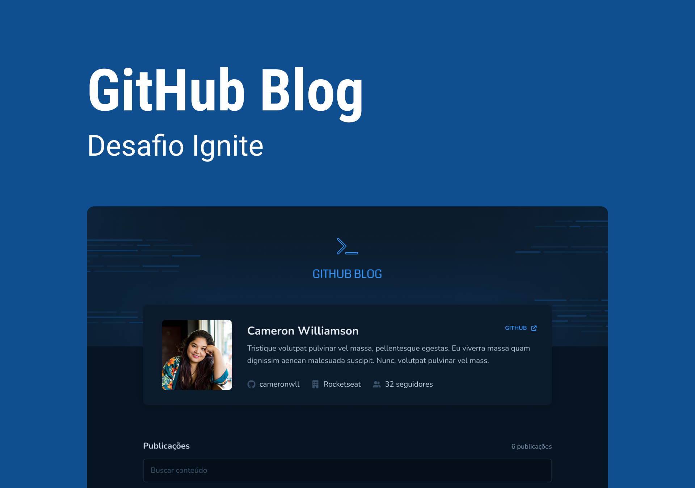

# Github blog

> Aplicação que apresenta em forma de blog as `issue` de um repositório no Github.

## 📲 [Link do deploy](https://dt-money-weld.vercel.app/)

## 📑 Sobre o projeto

Esta é uma aplicação é **o projeto de entrega** do módulo de "Consumo de API e performance no ReactJS" do curso de especialização Ignite.

## ✍🏻 Funcionalidades

-
-
-
-

## 🧠 Aprendizados

-
-
-
-

## 🛠 Tecnologias utilizadas

- Axios
- Phosphor-react
- React-hook-form
- Styled-components
